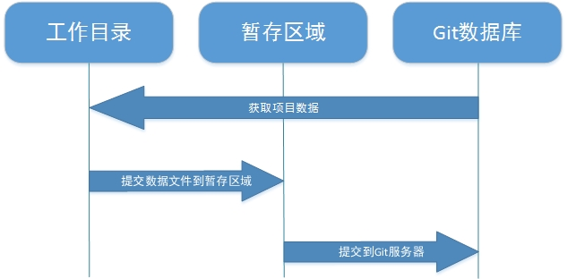

* content
{:toc}

## 简述

作为github开篇的博文，就对git以及github的使用做一个简单的介绍

我将git使用系统分成三部分：

* Git服务程序的使用

* Git分支管理
						   
* Github以及远程仓库管理的使用


## Git服务程序的使用

使用帮助

```
git [<command>] --help
```

Git服务程序的使用分为Git工作流程、Git配置信息、Git提交数据、Git历史数据及其操作、Git管理标签

### Git工作流程

Git需要把文件提交到Git数据库中来保存数据



* 将修改的文件快照提交到暂存区域

* 将暂存区域文件提交到Git服务器

* 可以通过下载等方式获取项目文件


### Git配置信息

Git配置信息分为三类：

* 系统中每个用户及仓库通用配置信息。					/etc/gitconfig

* 针对于当前用户的配置信息。 							~/.gitconfig 或者 ~/.config/git/config

* 针对于当前仓库数据的配置信息。						工作目录/.git/config

配置Git运行环境

```
使用git init
```

会在当前目录下生成.git文件


查看当前环境下运行的config信息

```
git config --list
```

比较重要的配置有用户名称和电子邮件地址

```
git config --global user.name "用户名"
git config --global user.email "用户邮箱"
```

其中有 --system、 --global、 --local、 --file <filename> 选项，默认是--local：此仓库的本地配置， global对应当前用户， system此系统

###Git 提交数据

查看当前工作目录状态

```
git status
```

工作状态有 已提交，已修改，已暂存，未跟踪

* 已提交(committed):表示数据文件已经顺利提交到Git数据库中。

* 已修改(modified):表示数据文件已经被修改，但未被保存到Git数据库中。

* 已暂存(staged):表示数据文件已经被修改，并会在下次提交时提交到Git数据库中。

* 未跟踪(untracked):还未提交，一般是新建的文件

将文件提交到暂存区

```
git add 文件名		//提交当前文件，可以多个
git add .           //将当前工作目录内的所有文件都一起添加到暂存区域
```

将暂存区的文件提交到Git版本仓库

```
git commit -m "提交说明”
git commit -a -m "Modified again"     //追加-a参数，这样Git会将以前所有追踪过的文件添加到暂存区后自动的提交，从而跳过了上传暂存区的步骤
```

### Git历史数据及其操作

查看历史记录，看到所有的更新记录（按时间排序，最近更新的会在上面），历史记录会除了保存文件快照，还会详细的记录着文件SHA-1校验和，作者的姓名，邮箱及更新时间，

```
git log
git log -2        			//查看最近的2条记录
git log -p -1    			//-p参数来展开显示每次提交的内容差异，例如仅查看最近一次的差异：
git log --stat -2 			//--stat参数来简要的显示数据增改行数，这样就能够看到提交中修改过的内容、对文件添加或移除的行数，并在最后列出所有增减行的概要信息（仅看最近两次的提交历史）
git log --pretty=oneline  	//--pretty参数，它可以根据不同的格式为我们展示提交的历史信息，比如每行显示一条提交记录

```


还原数据

```
git reset [<mode>] [<commit>] 
```
其中mode 参数 选择 --hard ，所有对跟踪文件的变化都会被放弃


命令来查看所有的历史记录,包括被还原点

```
git reflog
```

还原某个文件
```
git checkout -- <file>
```
checkout规则是如果暂存区中有该文件，则直接从暂存区恢复，如果暂存区没有该文件，则将还原成最近一次文件提交时的快照。


### Git管理标签

关于标签的操作
```
git tag 							//查看已有标签
git tag v<tagname>					//给最近的记录打上标签
git show v<tagname>					//显示此标签的详细信息
git tag -a v <tagname> -m <msg>   	//带有说明的标签  用-a指定标签名，-m指定说明文字：
git tag -d v1.0   					//删除标签
```


## Git分支管理

Git分支管理的使用分为Git分支基本操作、Git合并分支、Git解决冲突

### Git分支基本操作

```
git branch							//列出所有分支，当前的分支前有＊号
git branch -r 						//查看远程分支
git branch -a 						//查看所有分支
git branch 分支名					//创建分支
git checkout 分支名					//切换至分支
git checkout -b 分支名称			//创建分支并切换到该分支命令
git branch -d 分支名				//删除该分支
```

### Git合并分支

```
git merge 分支名				//将指定分支与当前所在分支合并
```

### Git解决冲突

当使用Git merge 命令后，Git 无法自动快速合并，需要手工处理分支后才能继续合并
直接查看 冲突文件，可以看到 Git用< <<<<<<，=======，>>>>>>>分割开了各个分支冲突的内容，我们需要手工的删除这些符号，并将内容修改为最终版本。再重新提交


## Github以及远程仓库管理的使用

Github以及远程仓库管理的使用分为添加密钥、仓库管理，在提交到Github远程仓库保管时，一种是使用账号密码登录，还有一种便是使用RSA密钥登录

### 添加密钥

生成密钥对
```
ssh-keygen -t rsa -C "email地址"
```
-t 是指创建密钥类型。 RSA非对称密钥密码体制
-C 添加注释
要求确认路径和输入密码，我们这使用默认的一路回车就行。成功的话会在~/下生成.ssh文件夹，进去，打开id_rsa.pub，复制里面的key。

生成私钥id_rsa，公钥id_rsa.pub  存储在服务器端

回到github上，进入 Account Settings（账户配置），左边选择SSH Keys，Add SSH Key,title随便填，粘贴在你电脑上生成的key。

为了验证是否成功，在git bash下输入：

```
ssh -T git@github.com
```

如果是第一次的会提示是否continue，输入yes就会看到：You've successfully authenticated, but GitHub does not provide shell access 。这就表示已成功连上github。


### 仓库管理
仓库也就是建立的repository

```
git remote [-v | --verbose]				//显示远程仓库 , -v 表示是否显示简单摘要
git remote add origin Github托管地址	//添加远程仓库， origin 是默认的远程仓库，添加后，远程库的名字就是origin，这是Git默认的叫法。 
```


尝试把版本仓库克隆到本地
```
git clone  项目地址
```

推送操作
```
git push -u origin master				//推送操作，把本地库的内容推送到远程，origin 推送仓库选择，master 推送分支选择
```
用git push命令，实际上是把当前分支master推送到远程，由于远程库是空的，我们第一次推送master分支时，加上了-u参数，Git不但会把本地的master分支内容推送的远程新的master分支，还会把本地的master分支和远程的master分支关联起来，在以后的推送或者拉取时就可以简化命令。

更新你的本地仓库至最新改动，执行：
```
git pull [options] [<repository> [<refspec>…?]]
```
以在你的工作目录中 获取（fetch） 并 合并（merge） 远端的改动
